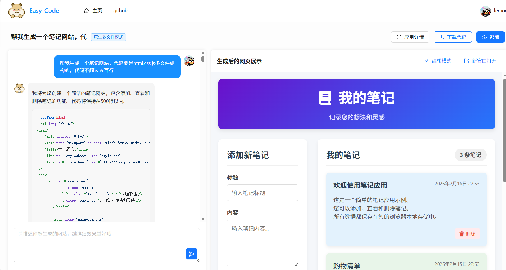

# Easy-Code介绍
## 引言
Easy-Code 是基于 **Spring Boot 3 + LangChain4j + Vue 3** 的企业级 AI 代码生成平台，核心聚焦 AI 开发与后端架构；
具备智能代码生成、可视化编辑、一键部署分享、企业级管理四大核心能力。

# 一、技术选型：
### 1. AI驱动架构
- LangChain4j + DeepSeek ：构建智能代码生成能力
- 多模型支持 ：根据场景选择不同AI模型
- 工具调用 ：让AI具备文件操作能力
### 2. 流式处理
- SSE技术 ：实时推送代码生成过程
- Reactor ：响应式编程，提升并发性能
- 虚拟线程 ：异步处理截图等耗时操作
### 3. 缓存策略
- Caffeine本地缓存 ：AI服务实例缓存，减少创建开销
- Redis分布式缓存 ：对话记忆存储，支持多实例部署
### 4. 多存储方案
- MySQL ：结构化数据存储
- Redis ：缓存与会话记忆
- COS ：静态资源与截图存储
- 文件系统 ：生成代码与部署文件
### 5. 开发效率
- MyBatis-Flex ：简化数据库操作
- Hutool ：工具类库，减少重复代码
- Lombok ：减少样板代码
- Knife4j ：自动生成API文档

# 二、生成效果:
### html单文件：

### html,css,js多文件：

### vue项目：

